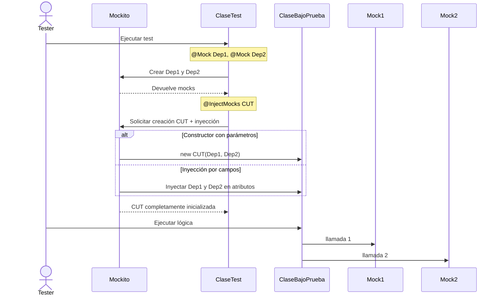
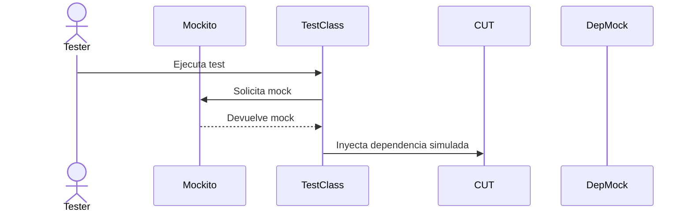
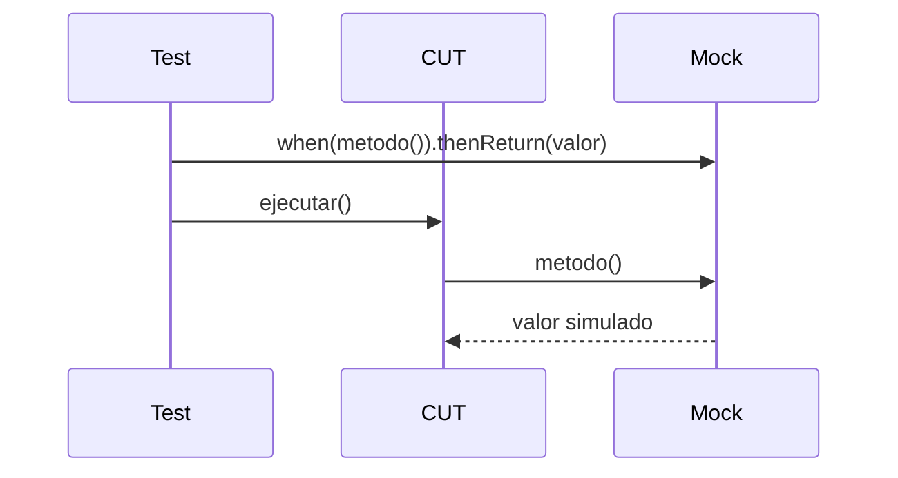
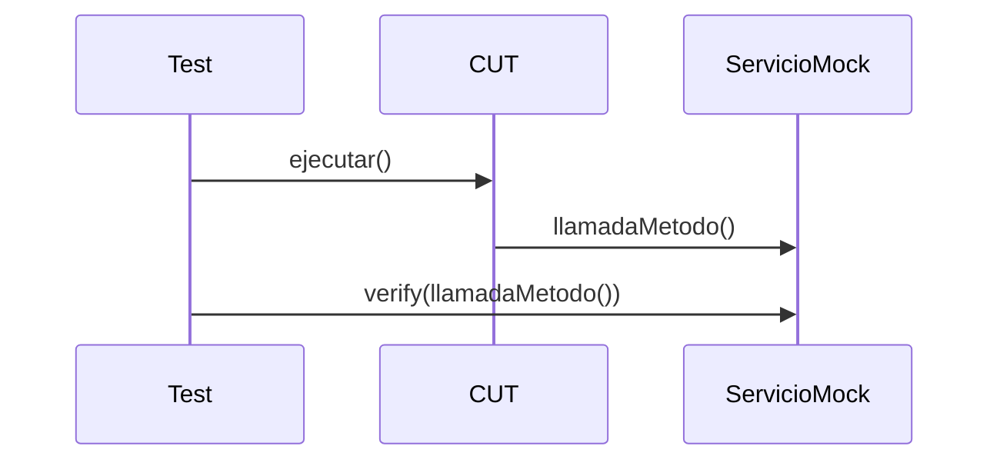

# Manual de Mockito  


## 1. Introducción

Mockito es un framework para crear dobles de prueba en Java (mocks) que permite aislar clases durante las pruebas unitarias. Este manual ofrece una guía práctica de aplicación centrada en TDD y arquitectura hexagonal.

## 2. Dobles de prueba: conceptos clave

### 2.1 Stub
Un **stub** contiene datos predefinidos. Se usa cuando la dependencia solo requiere getters y pertenece al dominio.

### 2.2 Mock
Un **mock** simula comportamiento controlado desde el test. Se usa con dependencias externas o de infraestructura.

### 2.3 Regla general
- **STUB** → modelos del dominio con solo getters  
- **MOCK** → servicios externos, repositorios, lógica no probada en esta unidad

## 3. Configuración de Mockito con JUnit 5

```xml
<dependency>
    <groupId>org.mockito</groupId>
    <artifactId>mockito-core</artifactId>
    <version>5.6.0</version>
    <scope>test</scope>
</dependency>
```

### Activación en JUnit 5
```java
@ExtendWith(MockitoExtension.class)
```

## 4. Creación de mocks

### 4.1 Con anotaciones
```java
@Mock
Servicio servicio;
```

### 4.2 Manualmente
```java
Servicio servicio = Mockito.mock(Servicio.class);
```
## 5. Inyecciones automáticas con `@InjectMocks`

### Inyección de mocks en la clase bajo prueba (@InjectMocks)

Mockito permite crear la clase bajo prueba (CUT: Class Under Test) de forma automática e inyectar en ella todos los mocks declarados con @Mock.

Esto se consigue mediante la anotación:

```java
@InjectMocks
```

### ¿Qué hace `@InjectMocks`?

Mockito analiza el objeto anotado con `@InjectMocks` y:

  1. Busca un constructor compatible, e injecta en él los mocks disponibles (si coinciden los tipos).
  2. Si no encuentra un constructor apropiado: crea la instancia vacía (constructor por defecto) e intenta inyectar mocks en: campos (por tipo) o atributos accesibles.
  3. Si hay más de un mock del mismo tipo: Mockito intentará resolver el tipo más específico. Si no puede, lanzará un error de inyección ambigua.

### ¿Cuándo se usa?

Se usa cuando:
 - la CUT tiene varias dependencias,
 - todas deben ser mockeadas,
 - y queremos evitar inicializaciones manuales en cada test.

Es ideal en:

- casos de uso,
- servicios de aplicación,
- servicios de dominio coordinadores.

Ejemplo del patrón general:

```java
@Mock  Repositorio repo;
@Mock  ServicioExterno externo;

@InjectMocks
GestorTareas gestor;   // CUT
```

Mockito creará automáticamente:

```java
gestor = new GestorTareas(repo, externo);
```
O, si no hay constructor, hará:

```java
gestor.repo = repo;
gestor.externo = externo;
```

### Ejemplo completo

```java
@ExtendWith(MockitoExtension.class)
class ControladorPedidosTest {

    @Mock
    ServicioInventario inventario;

    @Mock
    ServicioNotificaciones notificaciones;

    @InjectMocks
    ControladorPedidos controlador; // CUT

    @Test
    void creaPedidoCorrectamente() {

        when(inventario.hayStock("abc")).thenReturn(true);

        controlador.crearPedido("abc");

        verify(inventario).hayStock("abc");
        verify(notificaciones).enviarConfirmacion("abc");
    }
}

```
En este ejemplo se observa:
 - No necesitas construir `ControladorPedidos` manualmente.
 - Mockito detecta que requiere `ServicioInventario` y `ServicioNotificaciones`.
 - Los mocks apropiados son inyectados en la CUT.
 - El test se enfoca SOLO en el comportamiento de la CUT.

### Limitaciones

- No usa inyección por nombre, solo por tipo.
- Si hay dos mocks del mismo tipo, puede fallar.
- NO sustituye a frameworks de DI (como Spring).
- Si la CUT tiene lógica de creación compleja, conviene construirla manualmente.

## En resumen



## 6. Programación de comportamiento

### Sintaxis general
```java
when(mock.metodo(args)).thenReturn(valor);
```

### Excepciones
```java
when(mock.metodo()).thenThrow(new RuntimeException());
```

### Matchers
```java
when(mock.m(anyString())).thenReturn("ok");
```

## 7. Verificación de interacciones

### Básico
```java
verify(mock).metodo(args);
```

### Número de llamadas
```java
verify(mock, times(1)).guardar(any());
```

### Orden
```java
InOrder orden = inOrder(servicio1, servicio2);
orden.verify(servicio1).iniciar();
orden.verify(servicio2).procesar();
```

## 8. Diagramas de secuencia

### 8.1 Creación e inyección de mocks



### 8.2 Programación del comportamiento


### 8.3 Verificación


## 9. Ejemplo completo

```java
@ExtendWith(MockitoExtension.class)
class GestorPedidosTest {

    @Mock
    ServicioInventario inventario;

    @Mock
    ServicioPago pago;

    @Test
    void procesaPedido() {
        when(inventario.hayStock("abc")).thenReturn(true);
        when(pago.cobrar(50)).thenReturn(true);

        GestorPedidos gestor = new GestorPedidos(inventario, pago);

        boolean ok = gestor.procesar("abc", 50);

        assertTrue(ok);
        verify(inventario).hayStock("abc");
        verify(pago).cobrar(50);
    }
}
```

## 10. Errores comunes

- No usar `@ExtendWith(MockitoExtension.class)`
- Mockear modelos del dominio
- Verificar interacciones irrelevantes
- Usar matchers incorrectamente (`eq` + `any`)

## 11.  Conclusión

Mockito es esencial para TDD, permitiendo aislar comportamiento, controlar dependencias y verificar colaboraciones. Su correcto uso facilita pruebas mantenibles y una arquitectura hexagonal limpia.
